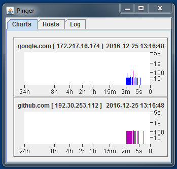
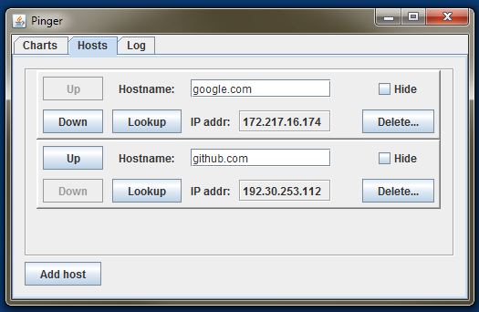
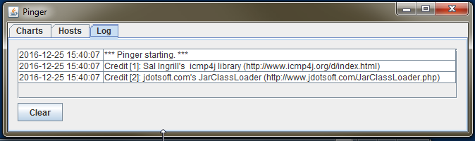

# About

**Pinger** is a Java/Swing desktop application to periodically ping a small
number of hosts and display the response times in simple bar graphs.

# Hosts
 
The hosts can be configured in the UI. Hosts and screen position are
persisted to `${HOME}/pinger.ini`.

# Operating parameters

* All hosts are pinged every 5 seconds.
* Echo events are recorded for up to 24 hours.
* Chart displays are updated every 200 ms.
* Event times and ping durations are displayed on exponential scales. 

# Code / Compatibility

My Java coding style attempts to minimize code, so it is *not* a model of 
pattern-oriented design. *There are no tests.* Error handling is minimal.

The code was developed using Oracle JDK 1.8 but the compliance of generated
code is dialled back to 1.6, so it should run in any JRE >= 1.6 on those
operating systems supported by *icmp4j* (see below).

# Usage

Download and/or extract **Pinger.jar** and run with

    java -jar Pinger.jar
    
*Pinger* recognizes *no* command-line parameters.    

# Dependencies / Acknowledgements

1. *Pinger* uses and is indebted to Sal Ingrill's 
[icmp4j](http://www.icmp4j.org/d/index.html)  
*icmp4j* is licensed under the GNU LGPL 3 with some provisos: [icmp4j readme.txt](3rdPty/readme.txt)   
*icmp4j* includes native libraries for Microsoft Windows&#8482; ,
Mac OS X&#8482; and Linux&#8482; operating systems, so *Pinger* 
is likely to run on recent versions of all of those.  
To date, I've only tested it under Windows 7.
2. *Pinger* uses jdotsoft.com's [JarClassLoader](http://www.jdotsoft.com/JarClassLoader.php) 
to non-explosively nest and load the *icmp4j* jars in `pinger.jar`.  
*JarClassLoader* is licensed under [the GNU GPL 3](http://www.gnu.org/copyleft/gpl.html) .

# License

Apart from its dependencies as mentioned above, *Pinger* is licensed under
[the MIT License](LICENSE)